# ConferenceAppointment
一个基于SpringCloud的微服务架构的会议预约系统，前后端分离，前端使用Vue开发。

项目简介：

- 本项目采用前后端分离结构，后端基于微服务架构
- 后端采用SpringCloud+SpringBoot进行微服务模块开发
- 项目采用Nacos作为服务注册中心和配置中心，通过Feign做服务间的调用，服务网关采用SpringCloud-Gateway作为项目统一入口
- 关系型数据库采用MySQL，并用Canal + RabbitMq监视binlog，做数据同步功能
- 缓存采用Redis，提高系统并发和高性能，同时集成Redisson做为分布式锁
- 前端使用Vue+ElementUI独立开发

项目结构

```txt
├─CA-Api					// 接口模块
│  └─CA-Api-System          // 系统接口
|─CA-Auth-10002				// 认证中心
├─CA-Common					// 系统通用模块
│  ├─CA-Common-Core			// 核心模块
│  ├─CA-Common-MQ			// 消息队列模块
│  ├─CA-Common-Redis		// 缓存模块
│  ├─CA-Common-Security		// 安全模块
│  └─CA-Common-Swagger		// 系统接口模块
├─CA-DataService-10001		// 系统数据服务模块
├─CA-FileService-10003		// 系统文件服务模块
├─CA-Gateway-10010			// 系统网关服务模块
├─CA-Monitor-10004			// 系统服务监视模块
├─CA-UI-9527				// 系统前端模块
```


Web效果图

>首页

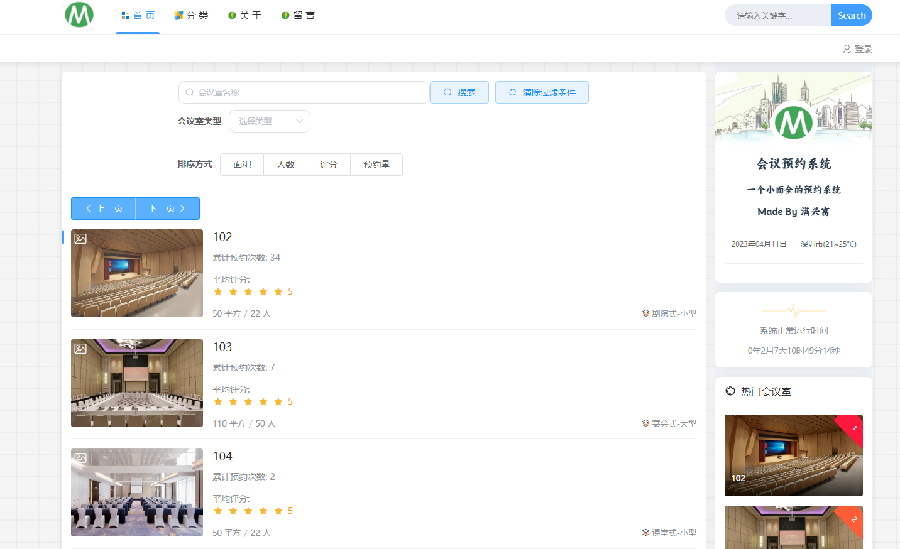

>预约页面

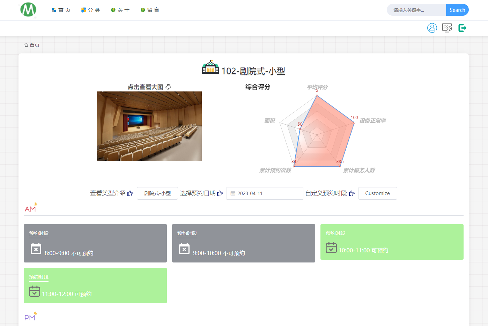

>预约

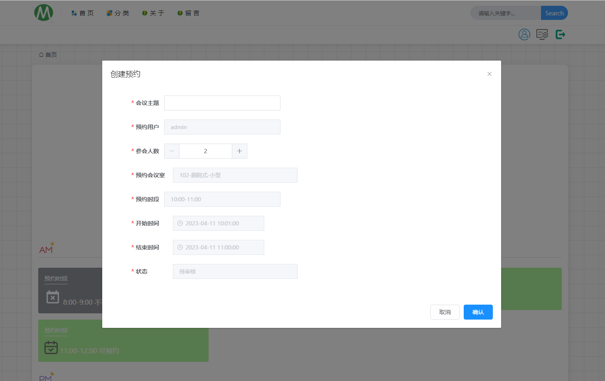

>个人中心

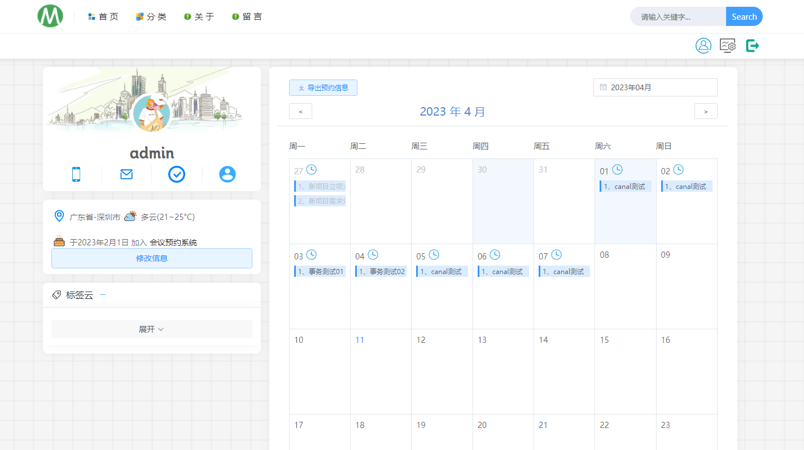

>管理后台 - API文档

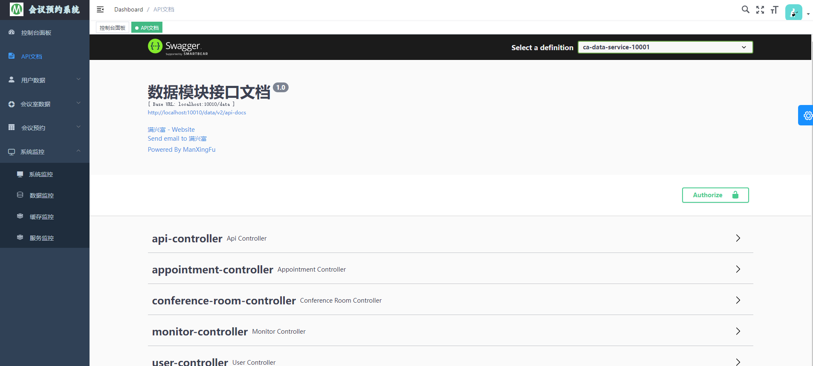

>管理后台 - 系统监控

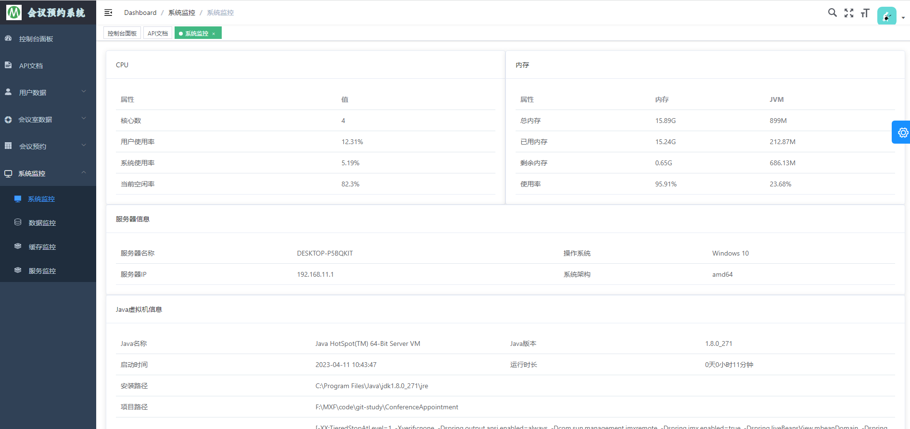

>管理后台 - 缓存监控

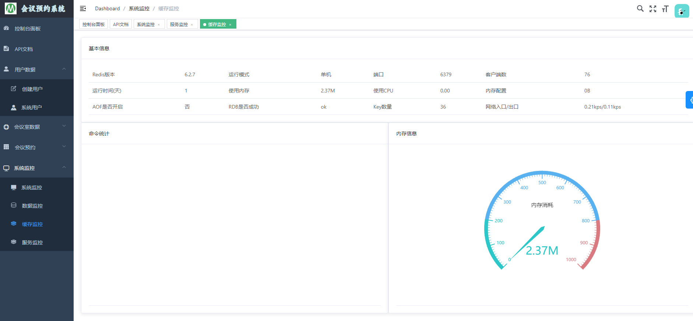


>管理后台 - 服务监控

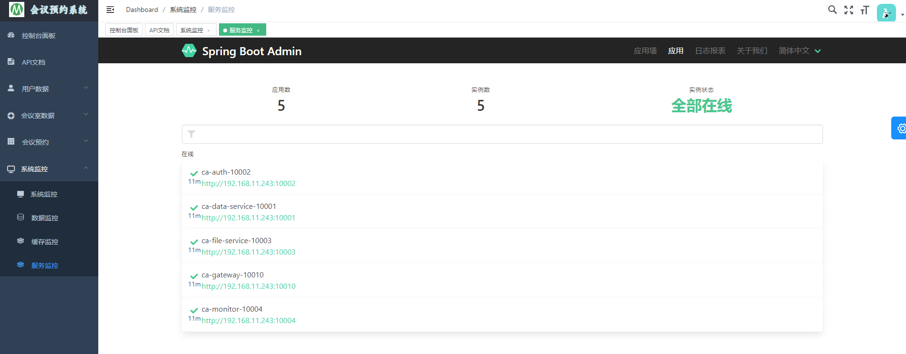

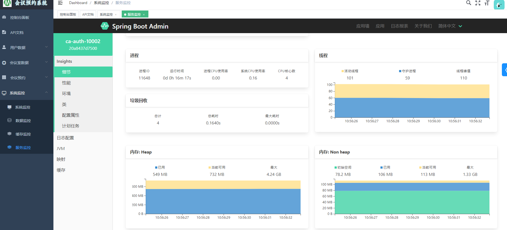

>管理后台 - 数据展示


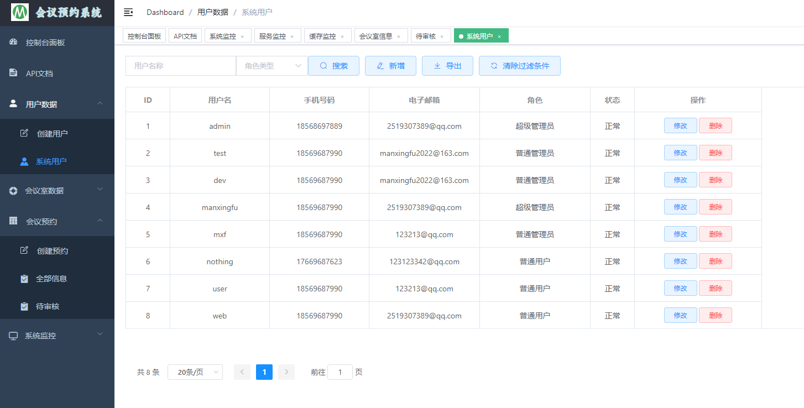


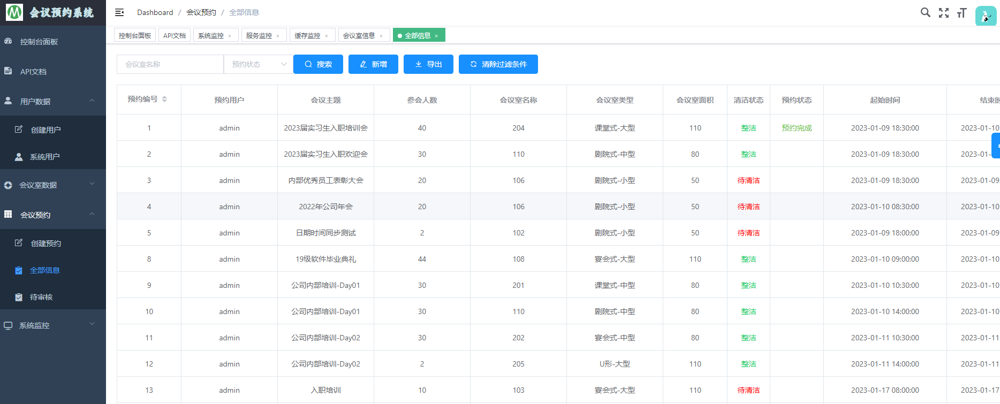


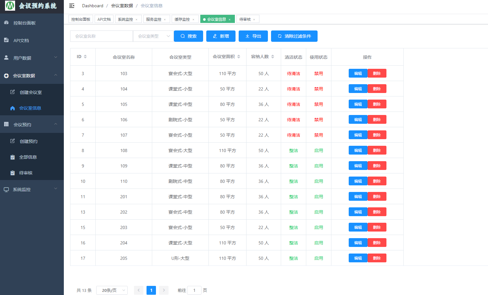

>管理后台 - 预约审核

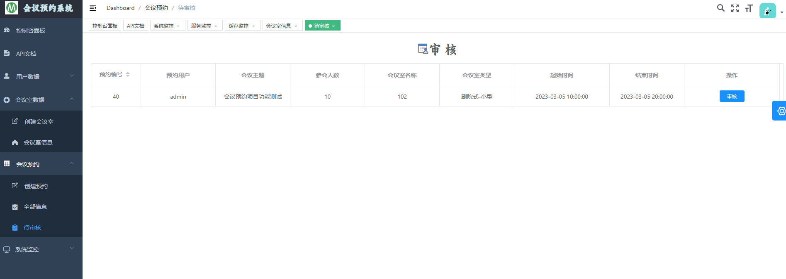

